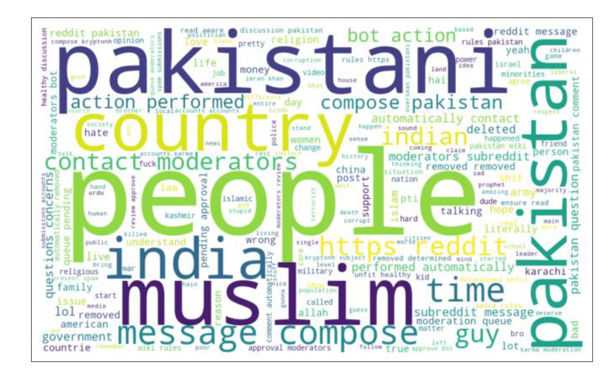

# CS 613: Natural Language Processing
## Group:- T7

### Tasks:
### 1. Dataset Description:
#### ● The dataset contains the top 100 posts from the Pakistan subreddit with the below
attributes:
➢ Attribute Information:
- Post Title (string)
- Post Id (alphanumerical)
- Post URL (string)
- Total number of Comments (numerical)
- Creation time (numerical - in seconds)
- Score (numerical)
#### ● The second dataset contains all the comments of the above 100 posts with the below
attributes:
➢ Attribute Information:
- Comment Id (alphanumerical)
- Comment parent Id (alphanumerical)
- Comment body (string)
- Comment depth (numerical)
- Comment score (numerical)
- Creation time (numerical - in seconds)
### 2. & 3. COLAB Link:
https://colab.research.google.com/drive/1hn7vdveNXLbKlMrS7qzL2wACWjTDUckE#scrollTo=Y7Jkm0A6JHPS

To know what any particular code is doing, please read the comment on the top of every Cell.

#### 4. We have done Exploratory Data Analysis (EDA) on 125 CSV files in the file “EDA.ipynb”.

#### 5. Here is the link for the Colab Notebook, which contains code for sampling 100 sentences randomly (annotated comments with majority label) for the entire corpus. Also, we have made sure that there is an equal proportion of sentiments (positive, nagetive and neutral):
https://colab.research.google.com/drive/1e8seneIG043BefMLFGhAbBVzzb4-MG0z5nm?usp=sharing

#### 6. During the annotation process, contextual information regarding comments is unavailable. A random selection of 100 comments is drawn from the entire corpus, ensuring an equitable representation of negative, positive, and neutral sentiments as labeled by the model. Annotators individually assess each comment based solely on its content and their immediate impressions.

### 7. Krippnedorff’s alpha = 0.53
#### 8. Here is the link for the Colab Notebook, which contains the code to get the majority vote of the three annotators' labels to get the majority label:
https://colab.research.google.com/drive/1e8eIG043BefMLFGhAbBVzzb4-MG0z5nm?usp=sharing

### Results:
1. While performing human evaluation with respect to sentiment analysis, it is observed that
the sentiment predictions generated by the model and those made by human annotators
diverge significantly.
EDA-based analysis:-

● There were a lot of comments which were either [removed], [deleted] or under
moderation. These were removed while preprocessing so as to do EDA.

● There were quite a number of comments with only usernames, subreddit, reddit
mentions which had to be removed while preprocessing.

● There were some comments which had urls, emails which do not form part of our
analysis, so we removed the urls and emails from the comments.

● There were words which had to be considered as spam due to their very long
length and had to be removed while comparing them to the vocabulary present in
wordnet corpus.

● The most frequent words were of a neutral to positive stance, while also
consisting of nationalistic or religious words like 'india', 'indian', 'pakistan',
'pakistani', 'muslim', 'allah', and so on.

● From the pairplot, though we could not find any significant correlation between
most frequent five words and upvote scores, we found some positive correlation
between the frequency (per comment) of some most frequent words.

### Human evaluation:-

● Among the 100 comments, discrepancies in the majority of annotations between
human annotators and the model were observed in 37 cases.

● The comments that exhibited mismatches predominantly featured a significant
usage of emojis and special characters that are not commonly found within the
Hinglish and English linguistic corpora. See all mismatched rows in google colab.

● After conducting a human analysis on the majority of labels, we discovered
significant disparities between the labels assigned through human evaluation and
those predicted by the model. A substantial number of comments, which were
predominantly neutral in nature, received positive or negative classifications from
the model. This divergence could potentially stem from the model's reliance on
the presence of negative keywords. Contrarily, humans tend to categorise a
comment as negative only when explicit vulgarity is used; otherwise, they
perceive it as an expression of opinion, which is often neutral. It's worth noting
that the model lacks the contextual understanding required to determine the
subject matter underpinning the sentiment judgment—whether a comment is
negative, positive, or neutral.
2. Word Cloud of the entire corpus using after removing the stop words and including set words whose length of at least 3:-

Here is the code for Word Cloud using the Word Cloud package for the entire corpus. (for
reference):

### References:
1. https://www.surgehq.ai/blog/inter-rater-reliability-metrics-an-introduction-to-krippendorffs-alpha
2. https://www.lighttag.io/blog/krippendorffs-alpha/
3. https://colab.research.google.com/drive/1lno4DQA_bdT2Xd8cv3mwtRnwR1MdM-3u#scrollTo=w2frnq1OczG3
4. https://praw.readthedocs.io/en/stable/
5. https://www.geeksforgeeks.org/generating-word-cloud-python/

### Contribution:

1. Data Scraping: Tejas Parmar

2. Sentiment Analysis through
models: Prakram Rathore
3. Exploratory Data Analysis Venkata Sriman Narayana Malli, Zeeshan Snehil Bhagat
4. Human Annotation: Rahul Kumar, Sandeep Patel, Dhakad Bhagat
Singh
5. Krippendorff’s alpha: Dhakad Bhagat Singh, Rahul Kumar
6. Creating word cloud Sandeep Patel, Prey Patel
7. Documentation: Prey Patel, Dhakad Bhagat Singh
-------------------------------